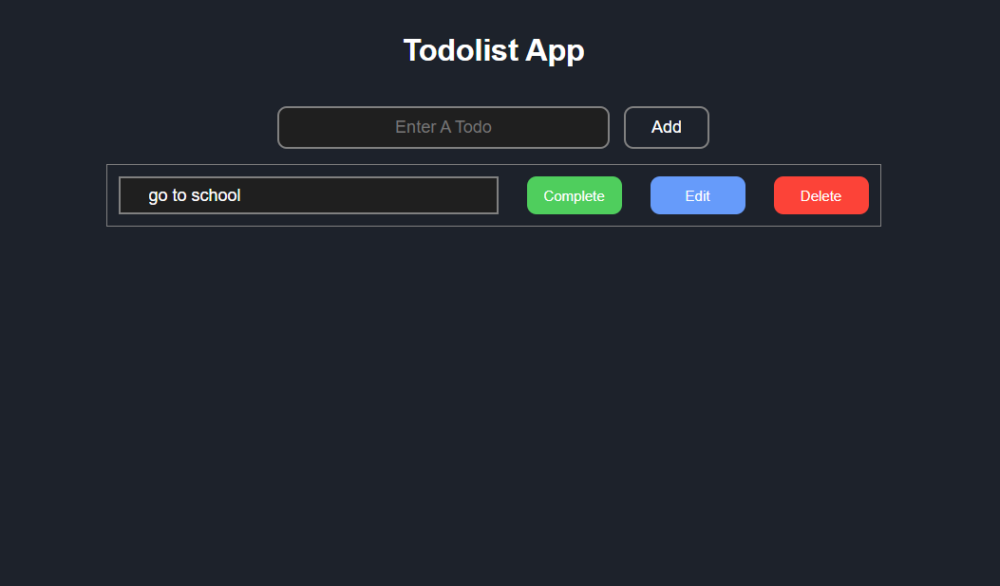
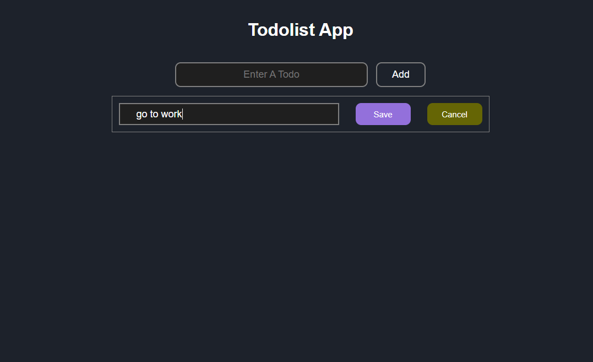
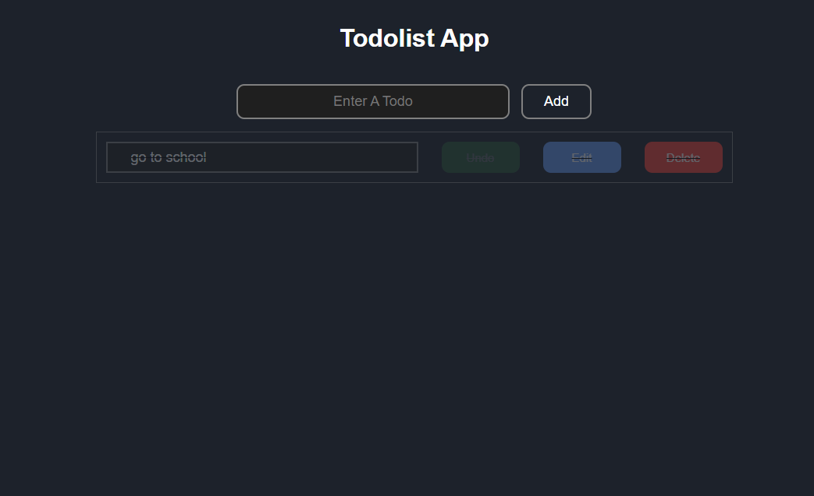

# 📝 TodoList App

یک اپلیکیشن مدیریت وظایف مدرن و کاربرپسند که با **React**، **TypeScript** و **Vite** ساخته شده است.

## ✨ ویژگی‌ها

- ✅ **افزودن وظایف جدید** - ثبت سریع و آسان کارهای روزمره
- ✏️ **ویرایش وظایف** - قابلیت تغییر متن وظایف به صورت inline
- 🗑️ **حذف وظایف** - امکان حذف کارهای انجام شده یا غیرضروری
- ✅ **علامت‌گذاری وضعیت** - مشخص کردن وظایف انجام شده
- 🔄 **قابلیت بازگشت** - تغییر وضعیت از انجام شده به انجام نشده
- ⌨️ **پشتیبانی از کیبورد** - استفاده از Enter و Escape برای مدیریت سریع
- 📱 **طراحی ریسپانسیو** - نمایش مناسب در تمام دستگاه‌ها
- 🛡️ **TypeScript** - ایمنی نوع داده‌ها و کدهای قابل اطمینان
- ⚡ **Vite** - اجرای فوق‌العاده سریع و توسعه آسان

## 🚀 تکنولوژی‌های استفاده شده

| تکنولوژی       | نسخه | کاربرد                          |
| -------------- | ---- | ------------------------------- |
| **React**      | 18.x | کتابخانه اصلی رابط کاربری       |
| **TypeScript** | 5.x  | ایمنی نوع داده‌ها و توسعه بهتر  |
| **Vite**       | 4.x  | ابزار build سریع و مدرن         |
| **UUID**       | 9.x  | تولید شناسه‌های یکتا برای وظایف |
| **CSS3**       | -    | استایل‌دهی و طراحی ظاهری        |

## 📦 نصب و راه‌اندازی

### پیش‌نیازها

- Node.js (نسخه 16 یا بالاتر)
- npm یا yarn

### مراحل نصب و اجرا

1. **دانلود پروژه**

```bash
git clone https://github.com/your-username/todolist-app.git
cd todolist-app
```

2. **نصب dependencies**

```bash
npm install
```

3. **اجرای پروژه در حالت توسعه**

```bash
npm run dev
```

4. **ساخت نسخه production**

```bash
npm run build
```

5. **پیش‌نمایش نسخه production**

```bash
npm run preview
```

## 🏗️ ساختار پروژه

```
todolist-app/
├── src/
│   ├── components/          # کامپوننت‌های ری‌اکت
│   │   ├── Form.tsx         # کامپوننت فرم افزودن وظیفه
│   │   ├── TodoList.tsx     # کامپوننت لیست وظایف
│   │   └── Todo.tsx         # کامپوننت آیتم تک‌تک وظایف
│   ├── types/               # تعاریت TypeScript
│   │   └── types.ts         # اینترفیس‌ها و تایپ‌ها
│   ├── App.tsx              # کامپوننت اصلی
│   ├── main.tsx             # نقطه ورود برنامه
│   └── index.css            # استایل‌های اصلی
├── public/                  # فایل‌های استاتیک
│   ├── index.html           # تمپلیت HTML
│   └── vite.svg             # آیکون
├── package.json             # تنظیمات پروژه و dependencies
├── vite.config.ts           # تنظیمات Vite
├── tsconfig.json            # تنظیمات TypeScript
└── README.md                # مستندات پروژه
```

### توضیح فایل‌های مهم:

- **`Form.tsx`**: مدیریت افزودن وظایف جدید
- **`TodoList.tsx`**: نمایش لیست تمام وظایف
- **`Todo.tsx`**: مدیریت هر آیتم وظیفه (ویرایش، حذف، تغییر وضعیت)
- **`types.ts`**: تعریف اینترفیس‌های TypeScript
- **`App.tsx`**: کامپوننت اصلی و مدیریت state

## 📸 اسکرین‌شات‌ها

### صفحه اصلی


_نمای کلی اپلیکیشن با لیست وظایف_

### حالت ویرایش


_ویرایش یک وظیفه موجود_

### وظایف کامل شده


_وظایف علامت‌گذاری شده به عنوان انجام شده_

## 🎯 راهنمای استفاده

### افزودن وظیفه جدید

1. **متن وظیفه را وارد کنید**

   - در فیلد متنی در بالای صفحه، عنوان وظیفه خود را تایپ کنید
   - متن می‌تواند حداکثر 100 کاراکتر باشد

2. **ثبت وظیفه**
   - کلید `Enter` را فشار دهید **یا**
   - روی دکمه `Add` کلیک کنید


### مدیریت وظایف موجود

#### ✅ تغییر وضعیت انجام

- روی دکمه **`Complete`** کلیک کنید
- وضعیت وظیفه به "انجام شده" تغییر می‌کند
- برای بازگشت، مجدداً روی دکمه **`Undo`** کلیک کنید

#### ✏️ ویرایش وظیفه

1. روی دکمه **`Edit`** کلیک کنید
2. متن جدید را در فیلد ویرایش وارد کنید
3. تغییرات را با کلیک روی **`Save`** ذخیره کنید
4. یا با کلیک روی **`Cancel`** لغو کنید


#### 🗑️ حذف وظیفه

- روی دکمه **`Delete`** کلیک کنید
- وظیفه بلافاصله از لیست حذف می‌شود

### ⌨️ میانبرهای کیبورد

| کلید     | عمل                             |
| -------- | ------------------------------- |
| `Enter`  | ذخیره کردن وظیفه در حالت ویرایش |
| `Escape` | لغو عملیات ویرایش               |
| `Tab`    | حرکت بین المان‌های صفحه         |

### 📱 استفاده در موبایل

- **افزودن**: از کیبورد مجازی استفاده کنید
- **ویرایش**: روی دکمه Edit ضربه بزنید
- **حذف**: روی دکمه Delete ضربه بزنید
- **تغییر وضعیت**: روی دکمه Complete ضربه بزنید

### 🎨 وضعیت‌های بصری

- **🔵 وظیفه عادی**: متن معمولی با زمینه تیره
- **✅ وظیفه انجام شده**: متن خط‌خورده با شفافیت کمتر
- **✏️ حالت ویرایش**: حاشیه آبی و دکمه‌های Save/Cancel

### ❗ نکات مهم

- وظایف خالی قابل ثبت نیستند
- می‌توانید همزمان چندین وظیفه داشته باشید
- وضعیت وظایف پس از رفرش صفحه حفظ نمی‌شود
- ویرایش برای وظایف انجام شده غیرفعال است

### 🔄 گردش کار نمونه

```bash
1. افزودن وظیفه: "خرید شیر"
2. کلیک روی Complete → وضعیت انجام شده
3. کلیک روی Edit → تغییر به "خرید شیر و نان"
4. کلیک روی Save → ذخیره تغییرات
5. پس از انجام، کلیک روی Delete → حذف از لیست
```
